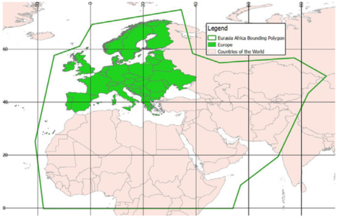
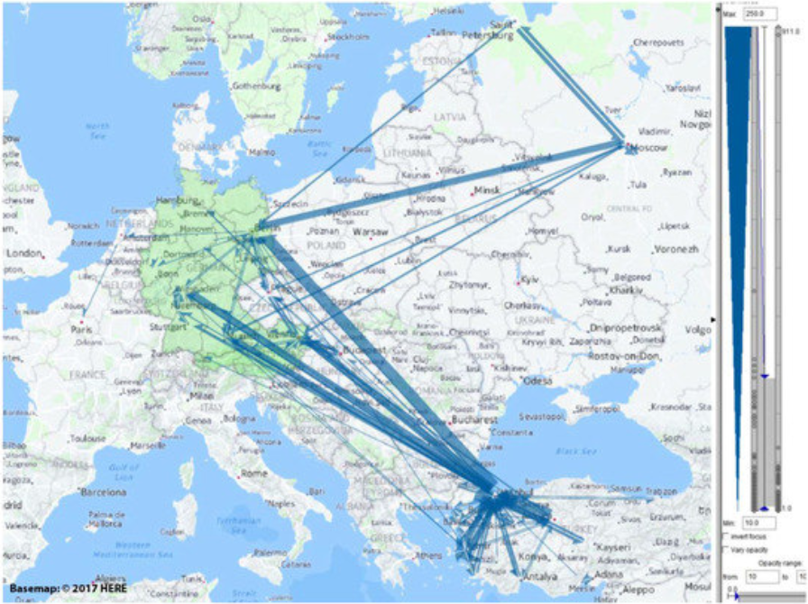
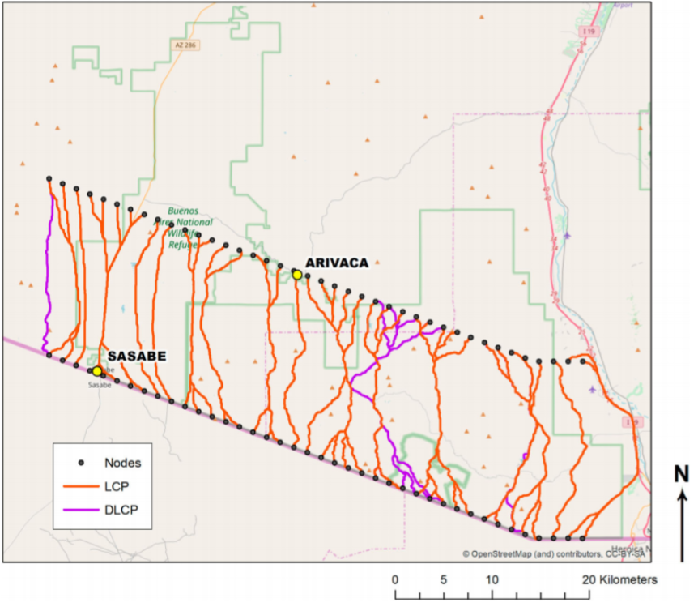
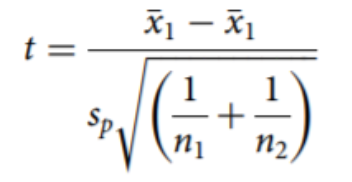
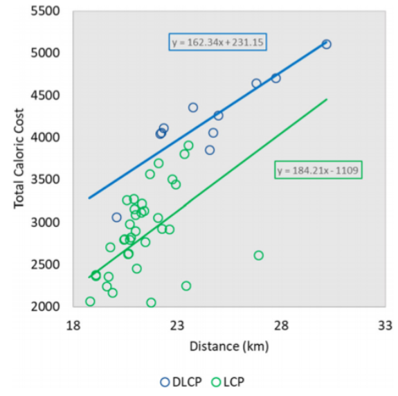

# Geospatial Methods for measuring mortality rate at international borders  
Jasmin Martinez
April 19, 2020

## Introduction 
Migration has been seen throughout centuries around the world. It has led to diversity and has allowed cultures to interact with one another. Migrants face a hard decision when deciding to leave their home countries due to economic, social, and political constraints and inequalities. To expand their real freedoms, migrants migrate to destination countries that provide a greater opportunity to increase these freedoms and progress in human development. I focused on two areas where migrant crossing has increased since the early 2000s: migration from Mexico to the United States, across the U.S./Mexico border, and migration from the Middle East to Greece, across the Mediterranean Sea. 

My dimension of human development relates to Amartya Sen’s definition of human development. Sen defines human development in his book Development as Freedom as “a process of expanding real freedoms that people enjoy.” My dimension relates to this definition when applied to the reasons for migrants leaving their home countries. Migrants face a hard decision to either stay in their home country to migrate to a destination country. 

This topic was considered while analyzing why these migrants are immigrating. Migrants tend to leave their home countries to end poverty, which is the first sustainable development goal. People leave their home countries in order to look for economic opportunities abroad, where the minimum wage is usually higher, where there are more jobs available for unskilled workers, and more affordable housing with better living conditions. Migrants leave their homes to receive a quality education or ensure their children have the opportunity to do so, which is the fourth sustainable development goal. Finally, migrants may choose to leave their country of origin to reduce the overall inequalities that are present in their nations, which is the tenth sustainable development goal. While migrants are trying to meet these sustainable development goals by moving to their destination country they are unfortunately faced with an increase in innovation and infrastructure at these boards, which forces them to find alternative ways to enter these destination countries. 

This increase in innovation and infrastructure is part of the ninth sustainable development goal. This strive towards reaching these four sustainable development goals shows how an increase in sustainable development and human development process can be both a positive and negative facet to migrants. Here, one can see the different perspectives on the impact of border security and in seeing this one can understand the difficult decisions destination countries must face when attempting to secure their borders.  

## Inquiry Type
With the many routes left to consider surrounding this topic, this geospatial human development process seeks to answer an explanatory inquiry. The inquiry placed here is How does human migration affect mortality at borders? My research is focused on the United States/Mexico border and the Mediterranean Sea. I researched variables that could affect the mortality rate at these borders with a heavy emphasis on surveillance and security. 

## Data/Methods 
Method 1: Geotagging 
In past years, migration was tracked using surveys and census’ but these efforts proved to be costly and time-consuming [11]. Therefore, Social media, such as Twitter, is now being used by institutions, such as the Institute for Cross-Disciplinary Physics and Complex Systems, to track human migration around the world. The data is collected from Twitter and is then handled in a meticulous manner in order to extract the correct information to display the routes migrants took based on the locations where they were tweeting from. This process is known as Geotagging and is explained in the article by Hübl [4]. 

The data collected of the investigation contains data including the user id, the creation date of the account, number of followers, the tweet itself, tweet id, text creation date and time, place, bounding box, place type, and position coordinates. The tweets are then filtered, processed, and a spatial filter is applied to the tweets in order to localize where the tweets are coming from on a map (figure 1). Variables such as speed, distance, and hashtag filters were used to base the movement of migrants between their home country and destination country. 

Figure 1
To visualize the most accurate patterns of movement, the V-Analytics software is used. This allowed the creating of a sorted list with locations and timestamps from the tweets. The trajectory points were extracted (this included start and end points along with any large pauses in movement) and those points were then placed into groups based on spatial proximity. The area is then partitioned into Voronoi cells, which were used as the locations to visualize movement. The trajectories were then divided into segments, in this case, a trajectory represents a sequence of Voronoi cells. The data is then aggregated and the aggregated movements are represented by arrows and the width of the arrows are proportional to the counts present on that route (figure 2).

Figure 2  

Method 2: Linear Regression Model 
In order to track the movements of migrants across the United States/Mexico border, a linear regression model was used to model the relationship between the distance of travel and the total caloric cost. To create the linear regression model the caloric distance was measured by calculating the potential metabolic rate, in watts, of the routes of travel[3]. In this case, the routes were all between Arizona, USA and Sonora, Mexico. The equations 

And 

Were used to calculate the total caloric cost to travel across a specific route.  In these formulas, w is the average weight of a person, l is the load carried in kg, v is the walking speed in m/s, s is the slope in the percentage of terrain, and n is the terrain factor [3]. 

In order to find the caloric cost of the different routes, hypothetical routes were created by placing a total of 80 Points were used, 40 of these points were in Mexico and 40 of these points were in the United States. These points were then connected using both LCP and DLCP, Calculated using the caloric cost equations above (figure 3). 

Figure 3

Once these routes were established, the sum of the caloric cost values of each route was calculated to produce the total caloric cost (TCC). TTC was calculated using the following two equations, 

And 
1
This allowed the investigation of any big significant differences between the LCP and DLCP of each route. The TCC of both the LCP and the DLCP were then used to Linear regression model in which showed the relationship between the TCC and the distance traveled Print routes between Arizona and Sonora (figure 4). 

Figure 4

## Results
The U.S./Mexico and Medditarrean Sea have seen an increase in migration from the early 2000s until now. These two borders have seen an increase in security and surveillance over the years due to the influx of migrants from the south. This increase has led to a “funnel effect” and pushed migrants to travel on routes that are more dangerous and high risk. I focused on the topic of human migration patterns to investigate if a correlation between increased security and increased mortality exists. 

At both borders, there are migrants crossing which are usually low-income and have seen a decline in education, economic, and social opportunities in their home countries [1]. Although these are all prominent push factors for these migrants, in “Who's crossing the border: new data on undocumented immigrants to the United States” Weeks explains that the biggest push factor is an increase in violence and corruption seen in these migrants countries of origin [1]. The weeks or months each migrant travels is full of dangerous terrain with unpredictable circumstances. As the number of migrants crossing these borders have increased, so have the efforts of nations to stop migrants from entering into their countries. An increase in surveillance and security at these borders has decreased the rate of migrants attempting to cross into their destination countries [2]. But, the migrants that are still attempting to cross this increase have led them to cross at areas that are more isolated and dangerous to go unnoticed and decrease apprehension risks [2]. This pattern, seen at the Medditarean border and the U.S./Mexico border is known as the “funnel effect”, defined as the forcing of migrants to travel through areas of high risk [3]. This has created hotspots in areas with less security and cold spots in areas that are known for high rates of apprehension [3]. At the Mediterranean border, there were 4,690 deaths reported in 2016, which was the year with the highest rate of migrants crossing [6].  

The increase in mortality at both borders shows how this process behaves as a complex adaptive system. As nations begin to criminalize unauthorized migration, there seems to be an increase in funding for security at these borders- both in manpower and physical barriers [2]. This increase in security leaves migrants forced to find new routes to enter their destination countries and in attempting to adapt to this change they are faced with new, unknown, and dangerous terrain. This new risk has led to an increase in migrant mortality. In “Mortality, Surveillance and the Tertiary “Funnel Effect” on the U.S.-Mexico Border: A Geospatial Modeling of the Geography of Deterrence” Chambers introduces the appalling fact that increased surveillance at the U.S./Mexico border has led to a 20-fold increase in death and disappearance of migrants [3]. Since the early 2000s, both borders have been through a process of emergence and, with rates of incoming migrants increasing, the emergence does not seem to decrease at any time in the near future. 
 
## Further Study
Research surrounding this topic has seen progress but seeing that human migration is hard to track due to the fears of migrants it still has many open routes to travel. In my research, it was difficult to find articles and papers that used the same models in both the U.S./Mexico border and the Mediterranean Sea. Due to this difficulty, it poses a problem when trying to correlate the two funnel effects occurring at both borders. The research papers I found and the references included below were focused on the spatial data, and few included temporal analysis. Finally, the biggest issue that was presented was these are hypothetical routes that migrants took or could take. Hübl’s data did not discern between the type of migration that was occurring across the Mediterranean Sea. The data could have included migration due to travel and this would have created an issue when analyzing the data. Chambers’s data was looking at the terrain of Arizona and Sonora and didn't use routes that are specifically used by migrants. The routes were more hypothetical and therefore the analysis could have flaws. In both cases, there are definitely improvements to be done but with the resources currently provided, they do present good models. In the future, with better resources and innovations in technology to be able to truly track these human migration patterns I believe we will have the opportunity to analyze this issue better. 

## References 

[1]  Weeks, J. R., Stoler, J., & Jankowski, P. (2010, December 27). Who's crossing the border: new data on undocumented immigrants to the United States. Retrieved February 16, 2020, from https://www.doi.org/10.1002/psp.563

[2] Martin, H. (2018). The Effects of Geospatial-Intelligence on United States-Mexico Border Security. Retrieved February 16, 2020, from https://www.aquila.usm.edu/cgi/viewcontent.cgi?article=2556&context=dissertations 

[3] Samuel Norton Chambers, Geoffrey Alan Boyce, Sarah Launius & Alicia Dinsmore (January 31, 2019). Mortality, Surveillance and the Tertiary “Funnel Effect” on the U.S.-Mexico border: A Geospatial Modeling of the Geography of Deterrence. Journal of Borderlands Studies. Retrieved on February 16, 2020, from https://www.doi.org/10.1080/08865655.2019.1570861

[4] Hübl, Franziska. Cvetojevic, Sreten. Hochmair, Hartwig. & Paulus, Gernot (2017, October 2). Analyzing Refugee Migration Patterns Using Geo-Tagged Tweets. Retrieved February 16, 2020, from www.mdpi.com/2220-9964/6/10/302.

[5] Datta, Anusya. (2016, December 12). These Maps Tell You All About Global Refugee Movement and Fatalities. Geospatial World. Retrieved February 17, 2020, from https://www.geospatialworld.net/blogs/global-refugee-movement-and-fatalities/. 

[6] Carrera, Sergio. Et al. (2016). The European Border and Coast Guard: Addressing migration and asylum challenges in the Mediterranean. Retrieved March 30, 2020, from http://www.aei.pitt.edu/83997/1/TFR_EU_Border_and_Coast_Guard_with_cover_0.pdf

[7] Greenough, Gregg & Nelson, Erica (2019, November 08). Beyond mapping: a case for geospatial analytics in humanitarian health. Retrieved March 30, 2020, from https://www.conflictandhealth.biomedcentral.com/articles/10.1186/s13031-019-0234-9 

[8] Hubl, Franziska (2016 August). Analysis of Migration Patterns of Refugees using Geotagged Tweets. Retrieved March 30, 2020, from https://www.static1.squarespace.com/static/559921a3e4b02c1d7480f8f4/t/596ca3bf2e69cffeddbee291/1500292041794/Huebl+Franziska_625.pdf 

[9] Brian, Tara & Laczko, Frank. Fatal Journeys: Tracking Lives Lost during Migration. Retrieved March 30, 2020, from http://www.lastradainternational.org/lsidocs/3089-FatalJourneys.pdf#page=87

[10] Wolff, Sarah (2008 June 2). Border management in the Mediterranean: internal, external and ethical challenges. Retrieved March 30, 2020, from https://www.researchgate.net/profile/Sarah_Wolff4/publication/249017147_Border_Management_in_the_Mediterranean_Internal_External_and_Ethical_Challenges/links/545356430cf26d5090a3af40.pdf 

[11] Buffa, Paul.(2019 August 30) Researchers Are Using Twitter to Track Immigrant Migration
National Geographic. Retrieved April 19, 2020  www.nationalgeographic.com/culture/2018/09/researchers-using-twitter-data-immigration-migration-graphic/#close.

